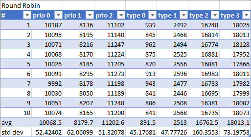
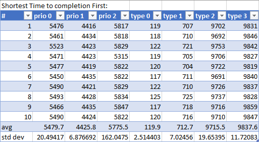
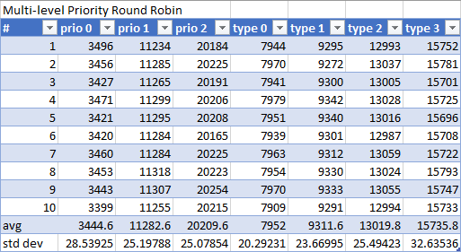
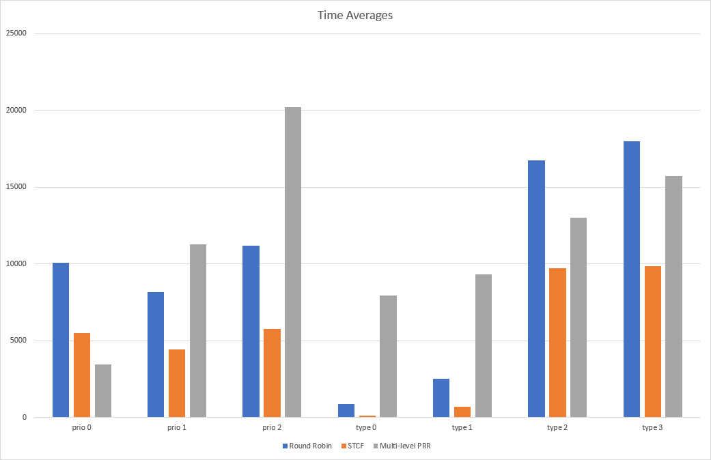
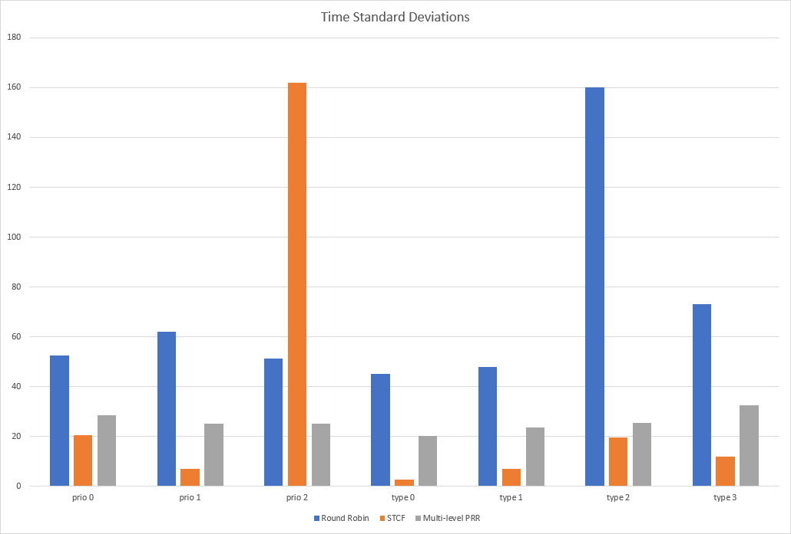

## Running Program

I coded the first question in python so there's no need to compile. Just type "python q1.py #" to run it, where # can either be 1, 2, or 3 depending on whether you want to run Round Robin, Shortest Time to Completion First, or Multi-Level Priority Round Robin. You will be prompted to enter a file name. processes.txt
will already be in the directory so feel free to just type that in, or put your own file in the same directory of the program and type that file name in instead.

Note: The STCF algorithm, as far as I'm aware, doesn't use a timeslice, it just runs the process closest to completion until it's done. So, in my implementation the STCF algorithm will just keep running the same process even if the timeslice is up, it can only be stopped through io. If an io happens, it will be moved back to the second spot in the queue and the second closest process to being done will begin to execute. 

## Output

The output of the program is the averaged times of each type and priority from the beginning of the program to when each of the processes completes. This means that if 
process A started running at time 200 and finished at time 300 it time value would be 300, in other words, the start time doesn't matter.

## Results

I gathered results for each of the three scheduling methods through running the program 10 times

Round Robin Results

Shortest Time to Completion First Results

Multi-Level Priority Round Robin Results

Comparing the average times across methods

Comparing the standard deviations across methods

## Report

The distributions are most definitely statistically significantly different. By looking at the average chart from average.png you can see that nearly all of the groupings   have a 2000 or greater time gap between them, which makes sense as the scheduling algorithms all provide different strengths and goals. It can also be noted in the stats   table for each of the algorithms that the standard deviation of each statistic is very low even after 10 trials. This is a good showing that the stats aren't likely to change much on subsequent runs which would incline me to say that the odds of these statistical differences happening by chance is very low. This greatly supports the statement that there is statistical significance in these numbers. For a final point, it can also be seen in the stddev.png that the standard deviations of each scheduling algorithm greatly differ from each other which is another example of these algorithms being different from each other/providing different benefits and drawbacks.

As mentioned above, you can see in the averages chart that there is a sizable gap between values in each of the groupings, and each grouping shows that some of these algorithms are better at some things than the others.

As we can see from that averages chart, it seems as though SJF/STCF is the optimal scheduling algorithm as it's going to be offering the best turnaround time. This is of course because it sets up the queue in a perfect way to complete the short tasks very quickly at the start and leave the longer tasks for later. You can see this from the averages chart, how type 0 and type 1 are completed incredibly quickly by the STCF algorithm and then there's a huge drop off in speed once we reach the longer threads as they're placed at the back of the queue. This wait for the longer threads can actually keep growing as, if we implemented this scheduler with preemption shorter processes could continuously get in the way of the longer ones. Although in many ways this scheduling algorithm seems very powerful, it's also not easy to get the needed information to use it. To use this properly you'll need to know the running time of your threads/processes before hand which severely limits where it can be applied. That's why, for the most part, this algorithm will be used in batch jobs where the runtime will likely be known.

A much more applicable algorithm is the round robin approach. While maybe not as great as STCF at turnaround time, one thing round robin does very well is response time. This can't be easily seen in any charts, but the idea is that round robin will quickly movie through every process in the queue, sharing resources fairly across everyone, and give every process a response as soon as possible. Not only that but, as seen from the average chart, round robin is also good at completing shorts tasks quickly (just look at type 0 and type 1). Because these threads/processes are so short they can be completed in just a few passes. This means that even though round robin focuses on sharing resources, it can still complete these tasks in a timely manner. Although, it can also be said that it struggles with longer tasks. You can see this by looking at type 2 and type 3. If a round robin scheduler gets stuck with a bunch of long processes in its queue it's going to keep cycling through them all just completing a little bit at a time which will likely delay their completion. All in all, this scheduler as many strengths without any huge downsides, making it a good choice for a lot of all purpose schedulers that don't need any special or edge case functionality.

The final algorithm is the multi-level priority round robin queue. The goal of this algorithm is to complete high priority tasks as soon as possible as they obviously hold some importance. You can see this looking at the averages chart how this algorithm actually has the best performance for the high priority processes/threads, then it steadily gets worse to having the worth performance on the lowest priority. This is accomplished by splitting the main queue into multiple queues with varying priority levels. The scheduler will them make sure that all processes in the high priority queue get ran first, then all processes in the next highest priority queue, and so on. You can see that this algorithm may not prove very useful on completing short processes very quickly like round robin and STCF (as can be seen by looking at type 0 and type 1 on the average chart). But, the real purpose of this scheduler is to make sure high priority tasks are always ran with great response time and turnaround time. You would see this kind of scheduler in some environment where whenever high priority tasks arrive, they must be executed as soon as possible.

As can be seen in the Operating Systems text, STCF is very good for turnaround time, but not the best at response time. Round Robin is just the opposite. Great response time, making the all processes feel like they're running simultaneously, but now the best turnaround time. And then there's the multi-level priority RR queue which does a great job with high priority tasks, but may choke up on the lower priority ones. It's clear to see that all of these algorithms have their own place and would be used in certain situations. The data collected and charts show that these algorithms shine in different areas, the main factor is deciding what algorithm fits best for what you're trying to accomplish.

Michael Bathie, 7835010

