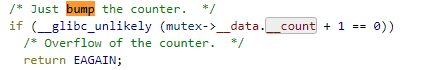

## Run the Program
Compile the program, type: make build
Run, type: make run
Clean all object files, type: make clean

## Report
The program creates 10 threads and has them run through a function with a lock. It can be seen by the output that when one thread acquires the lock, no others can enter until it releases it. This statement is supported by the pthread mutex lock man page which states: "If the mutex is already locked, the calling thread shall block until the mutex becomes available."

We can see, at least with pthread mutex locks, that when a thread acquires the lock no other thread can get it. They all are blocked on the lock call and have to wait for the thread with the lock to unlock it.

From the output you can see that pthread mutex locks act exactly how semaphores would in this situation, or more specifically, binary semaphores. If we pretend our mutex was a semaphore, once a thread acquires it the value of the semaphore is decremented by 1 and checked if negative. If it's not then the thread can acquire the lock. This means that when the next thread comes along and tries to acquire the lock value is decremented by 1 and checked for negativity again, but this time it is negative so the thread can't enter the lock (binary semaphores initial value is 1). Once the thread holding on to the lock is finished it releases it and a signal is sent to all threads blocked on that lock giving one of them the opportunity to grab it. As you can see, even if the lock in this program is treated as a semaphore it stills performs the exact same way as when it's a pthread mutex lock, so I would say that a pthread mutex lock is a semaphore.

pthread mutexes being semaphores is also support by one of the pthread mutex types, RECURSIVE. Having a mutex with this type will have it maintain a count. Initially this count is set to 1, when a thread attempts to get the lock it is decremented, when a thread releases the lock it is incremented. This allows you to keep track of how many threads are currently waiting on this lock, and this performs exactly like a semaphore.

As a note, it also seems that threads are queued on the lock depending on the order they tried to acquire it in. Although, after doing some research it seems that this isn't guaranteed to happen, it just seems to happen most of the time.

From looking through the pthread mutex lock source code I found a few instances that make me believe it's a semaphore. All of the things I found have to do with a counter being changed, which is what happens with semaphores.

Michael Bathie, 7835010
